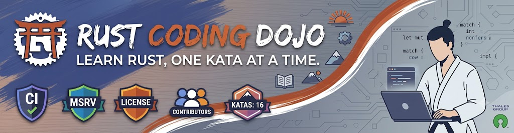

# Welcome in Rust coding dojo repository !



<p align="center">
  <a href="https://github.com/NicolasPayneauT0132431/rust-coding-dojo/actions/workflows/ci.yml"></a><br>
  <a href="https://github.com/NicolasPayneauT0132431/rust-coding-dojo/actions/workflows/msrv.yml"></a>
  <a href="https://github.com/NicolasPayneauT0132431/rust-coding-dojo/actions/workflows/deny.yml"></a><br>
  <a href="https://github.com/NicolasPayneauT0132431/rust-coding-dojo/actions/workflows/nightly.yml"></a>
  <a href="https://github.com/NicolasPayneauT0132431/rust-coding-dojo/actions/workflows/release.yml"></a>
  <a href="https://github.com/NicolasPayneauT0132431/rust-coding-dojo/releases"></a><br>
  <a href="https://github.com/NicolasPayneauT0132431/rust-coding-dojo/commits/main/"></a>
  <a href="LICENSE"></a>
  <a href="CHANGELOG.md"></a>
  <a href="https://github.com/NicolasPayneauT0132431/rust-coding-dojo/commits/main"></a><br>
  <a href="https://github.com/NicolasPayneauT0132431/rust-coding-dojo"></a>
  <a href="https://github.com/NicolasPayneauT0132431/rust-coding-dojo/graphs/contributors"></a>
  <a href="https://github.com/NicolasPayneauT0132431/rust-coding-dojo"></a>
  <a href="https://github.com/NicolasPayneauT0132431/rust-coding-dojo"></a>
  <br>
  <a href="https://github.com/NicolasPayneauT0132431/rust-coding-dojo/issues"></a>
  <a href="https://github.com/NicolasPayneauT0132431/rust-coding-dojo/issues?q=is%3Aissue+is%3Aclosed"></a>
  <a href="https://github.com/NicolasPayneauT0132431/rust-coding-dojo/pulls"></a>
  <a href="https://github.com/NicolasPayneauT0132431/rust-coding-dojo/pulls?q=is%3Apr+is%3Aclosed"></a>
  <a href="https://github.com/NicolasPayneauT0132431/rust-coding-dojo/stargazers"></a>
  <a href="https://github.com/NicolasPayneauT0132431/rust-coding-dojo/network/members"></a><br>
  
  
  
  
</p>

This place is intended to provide resources, documentation and templates to organize coding dojo sessions about Rust language.
Feel free to open an issue if you wish to add a new one, update an existing one or if you have any question.

## Repository Summary


## Rust Katas

A code **kata** is a software development exercise in which the focus is not on solving a task or problem, but on **learning new skills and developing successful routines**. For each code kata, **several solutions** have to be found in order to **learn from mistakes, gain experience** and develop even better solutions.

You can find many katas here: https://codingdojo.org/kata/

In [katas](./katas) directory, you will find here all the available katas about Rust language organized in categories:
- **setup**: for beginners, to learn about Rust installation, dependencies management with Cargo, compiler
- **starter**: for beginners and intermediate, to learn about variables, control flow, loops and functions
- **structure**: for intermediates, to learn about String manipulation, data structures and enums
- **advanced**: for experts, to learn about advanced topics such as concurrency generics, lifetime, macros

All katas share the same structure:
```
/XX-package/XX-kataname
|- src
   |- bin
      |- exercise_1.rs
      |- exercise_2.rs
   main.rs
   ...
|- solutions
   |- exercise_1.rs
   |- exercise_2.rs
   ...
Cargo.lock
Cargo.toml
```
The kata may consist in a single program with gaps, then we put the program source in the `src` folder at kata's root, and the main function in `src/main.rs`. Then, it can just be run by calling the command `cargo run`.

If the kata consists in several small exercise programs, we put all the exercises in a `src/bin` folder at kata's root.
We can just run the exercise by calling `cargo run --bin <exercise_n>` to run the targeted exercise, without needing the others to compile, or to comment anything.

## Academy — Interactive Learning Platform 🚀

The [academy](./academy) is the browser learning app for this repository.
It turns katas into an interactive Rust dojo with guided progression, a built-in editor, execution feedback, and an AI mentor.

### 🎬 Demo

<p align="center">
  
</p>

### ✨ What you get

- **🧭 Onboarding + progression**: first-run onboarding, local profile, XP, levels, streak, badges, and per-kata progression persisted locally.
- **🗺️ Parcours-first flow**: learners start on the parcours page, pick a kata, then move to the editor.
- **⚙️ Kata execution pipeline**: user code is compiled/executed through Rust Playground API and validated against expected behavior.
- **✅ Result gate quality**: kata success is based on runtime behavior checks (including output comparison against solution output cache), not only placeholder removal.
- **📚 Full kata corpus**: academy data is generated from the repository katas (`starter`, `structure`, `advanced`) and includes full README-based instructions.
- **📘 Instruction UX**: full instructions open in a modal (Markdown interpreted to HTML), with quick re-open from the editor toolbar.
- **🤖 Ferris mentor (local LLM)**: contextual chat assistant powered by `@wllama/wllama`, with streaming answers and Markdown rendering.
- **📱 PWA support**: installable app with service-worker caching.

### 🧱 Academy stack

- **Frontend**: React 18 + TypeScript + Vite
- **Editor**: CodeMirror 6 (Rust language support + diagnostics)
- **Persistence**: IndexedDB + localStorage
- **LLM**: `@wllama/wllama` running in-browser
- **PWA**: `vite-plugin-pwa`

### 🛠️ Run locally

```bash
cd academy
npm install     # install dependencies
npm run dev     # start dev server (http://localhost:5173)
npm run build   # production build → dist/
```

### 🔄 Data generation

Kata data used by the academy is generated from repository sources:

```bash
cd academy
node tools/generate-katas.cjs
```

This command updates `academy/src/data/katas.generated.ts` from `katas/**`.

### 🧑‍💻 Notes for contributors

- If you add/rename kata folders, regenerate academy data before committing.
- If you modify UI behavior around progression or validation, verify from the parcours screen and one full kata run.
- Keep README rendering in modal instruction view Markdown-compatible (headings, lists, code blocks).

The academy is automatically deployed to GitHub Pages on every push to `main` touching `academy/`.

## AI Harness — Agentic Coding Assistant

The [rewards/harness](./rewards/harness) provides skills and configurations for AI coding assistants (OpenCode, GitHub Copilot) to assist Rust development:
- **5 skills** covering development, quality, security, refactoring, and testing
- **OpenCode plugin** with latest Rust documentation references
- **Copilot instructions** with Rust code generation and review rules

## Development

All katas are organized as a Cargo workspace. You can run common commands from the repository root:

```bash
# Build all katas
cargo build --workspace

# Run all tests
cargo test --workspace

# Run linter
cargo clippy --workspace

# Format code
cargo fmt --all
```

## CI Quality Automation

### Automatic checks (run automatically)

The **CI** workflow is activated automatically on:

- push to `main`
- pull requests targeting `main`

It enforces quality gates:

- `rustfmt --check` on changed `.rs` files in each push/PR
- `cargo clippy --workspace --exclude ownership-borrowing`
- `cargo doc --workspace --no-deps --exclude ownership-borrowing` with `RUSTDOCFLAGS="-D warnings"`

## Documentation Sync Instruction

This repository provides an agent-agnostic docs-sync instruction at:

- `docs/agent-instructions/docs-sync/INSTRUCTION.md`
- Usage guide: `docs/agent-instructions/docs-sync/USAGE.md`

Use it at the end of any change to detect and fix documentation drift before opening or updating a PR.

Mandatory completion output:
- `docs updated: <file list> — <reason>` or
- `no docs changes needed: <explicit reason>`

## Contributing

If you are interested in contributing to this repository please send an email to oss@thalesgroup.com, find more details about how to contribute [here](https://github.com/ThalesGroup/rust-coding-dojo/blob/main/CONTRIBUTING.md)

## License

License under [Apache V2 license](https://github.com/ThalesGroup/rust-coding-dojo/blob/main/LICENSE) 
